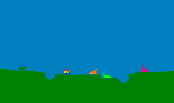



## Tank 1999\!\!\!

### Description

THIS is code you've got to see. I won the Code-Of-The-Month award for a game I submitted in August, the previous version of this. Several comments pressured me to develop it more. This is new and improved, new graphics + sounds, features, and more!!! I would have submitted this code about three months ago, but the sound files made it too large, and there would be a big unhandled error if they were missing. I fixed that, and now you can enjoy it without sound.

Visit my web site at www.geocities.com\Digitronix!!!
 
### More Info
 
There are still bugs in the code, and I will strive to fix those before the end of the school year.

To reduce the size of the download, I took all the sound files out. If you desire sound for this program, please visit the Digitronix Web Site.

             |
---                |---
**Submitted On**   |1999-12-28 13:55:38
**By**             |[Jon Feucht](https://github.com/Planet-Source-Code/PSCIndex/blob/master/ByAuthor/jon-feucht.md)
**Level**          |Advanced
**User Rating**    |5.0 (35 globes from 7 users)
**Compatibility**  |VB 5\.0, VB 6\.0
**Category**       |[Games](https://github.com/Planet-Source-Code/PSCIndex/blob/master/ByCategory/games__1-38.md)
**World**          |[Visual Basic](https://github.com/Planet-Source-Code/PSCIndex/blob/master/ByWorld/visual-basic.md)
**Archive File**   |[CODE\_UPLOAD35572222000\.zip](https://github.com/Planet-Source-Code/jon-feucht-tank-1999__1-6210/archive/master.zip)

